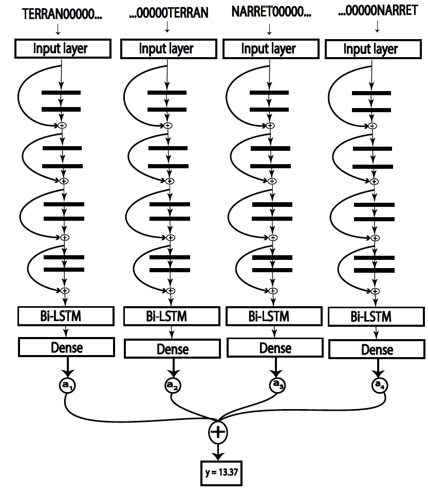

# HydraMethod (Beta-version)
## The *Hydra* method makes it possible to significantly improve the efficiency of a model that uses *1-Dimensional* sequences as data-input.

The *Hydra* method utilize the fact that, in some circumstances, the sequence can be represented in several ways. These different representations are then streamlined through different architectures (ResNet10-RNN-Dense used in the paper) that will be referred to as *heads*. For example, the sequence *TERRAN* can be represented as *TERRAN000...*, *...000TERRAN*, *...000NARRET* and *NARRET000...*. See figure below,

At the moment, the *Hydra* method is only compatabale with sequences with length of 32 and the output is 1D real value.
